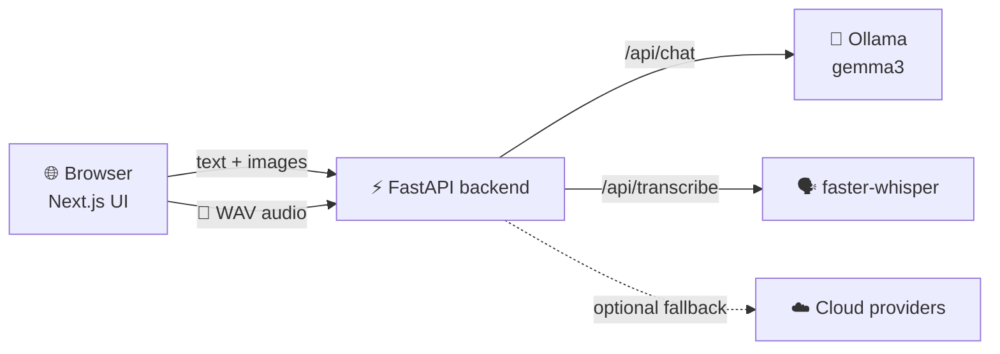

<div align="center">

# 🤖 OpenChat

### A private AI assistant that runs on your own machine, with 🎤 voice and 🖼️ image input


**Local-first • Free • Open source tools only • No data leaves your computer by default**

</div>

<!-- After you add a screenshot to docs/screenshot.png, remove this line's comment marks:

-->

---

## ✨ Features

| | Feature | What it does |
|---|---|---|
| 💬 | **Streaming chat** | Replies appear word by word, with history, copy and regenerate |
| 🎤 | **Voice input** | Click the mic, speak, and your words are transcribed locally by faster-whisper |
| 🖼️ | **Image understanding** | Attach up to 4 images and ask questions about them, powered by gemma3 vision |
| 🏠 | **Local models** | Runs on [Ollama](https://ollama.com), so your chats stay on your machine |
| ☁️ | **Cloud fallback** | Optional: add an API key and the app can fall back to a cloud model |
| 🔀 | **Model picker** | Switch between your installed models from the menu |

---

## 🧩 How it works



### 🎤 Voice input flow

1. The browser records your voice with `MediaRecorder`
2. The Web Audio API converts it to a 16 kHz mono WAV file
3. The WAV is uploaded to `POST /api/transcribe`
4. faster-whisper (Whisper `base` model, CPU) turns it into text
5. The text lands in the input box so you can edit it before sending

### 🖼️ Image understanding flow

1. Pick images with the 🖼️ button (they are shrunk to 1024 px in the browser)
2. Images travel with your message as base64 to `POST /api/chat`
3. The backend passes them to Ollama's `images` field
4. gemma3 reads the image and your question together and streams back an answer

---

## 🛠️ Tech stack

| Layer | Tools |
|---|---|
| 🎨 Frontend | Next.js, React, Tailwind CSS |
| ⚙️ Backend | FastAPI, Pydantic, uv, ruff, pytest |
| 🧠 Language and vision model | Ollama + gemma3 |
| 🗣️ Speech to text | faster-whisper |

---

## 🚀 Quick start

### 📋 You will need

- 🐍 Python 3.13 or newer and [uv](https://docs.astral.sh/uv/)
- 🟢 Node.js 20 or newer
- 🦙 [Ollama](https://ollama.com) installed and running

### 1️⃣ Get the model

```bash
ollama pull gemma3
```

> 💡 The default `gemma3` (4B) understands images. The tiny `gemma3:1b` version does not.

### 2️⃣ Start the backend

```bash
cd api
uv sync
uv run fastapi dev app/main.py
```

The API runs at http://127.0.0.1:8000 and its interactive docs are at http://127.0.0.1:8000/docs

### 3️⃣ Start the frontend (in a second terminal)

```bash
cd web
npm install
npm run dev
```

### 4️⃣ Open the app

Go to 👉 **http://localhost:3000**

> 🎤 The very first voice message downloads the Whisper model once (needs internet). After that, it works offline.

### ☁️ Optional: cloud fallback

Copy `api/.env.example` to `api/.env` and add a provider key. Never commit your `.env` file.

---

## 📁 Project structure

```
openchat-ai-assistant/
├── api/                      ⚙️ FastAPI backend
│   ├── app/
│   │   ├── core/             settings and logging
│   │   ├── providers/        Ollama and cloud providers
│   │   ├── routes/           chat, models, health, transcribe
│   │   ├── services/         chat service and speech.py (Whisper)
│   │   ├── schemas.py        request and response models
│   │   └── main.py           app entry point
│   └── tests/
└── web/                      🎨 Next.js frontend
    ├── app/                  pages and layout
    ├── components/chat/      composer, messages, sidebar, model picker
    ├── hooks/                use-chat, use-models
    └── lib/                  API client, types, helpers
```

---

## 🔌 API endpoints

| Method | Endpoint | Description |
|---|---|---|
| `POST` | `/api/chat` | Streams a reply (server-sent events), accepts optional `images` |
| `POST` | `/api/transcribe` | Upload a 16 kHz WAV, get back `{ "text": "..." }` |
| `GET` | `/api/models` | Lists the models available right now |
| `GET` | `/api/health` | Health check |

---

## 🩺 Troubleshooting

| Problem | Fix |
|---|---|
| 🔴 "API offline" in the app | Start the backend: `uv run fastapi dev app/main.py` inside `api/` |
| 🦙 No models listed | Start Ollama, run `ollama list`, then click **Refresh models** |
| 🖼️ Model says "please provide the picture" | Use a vision model such as the default `gemma3` (not `gemma3:1b`) |
| 🎤 Mic does nothing | Open the app at `http://localhost:3000` and allow microphone access |
| ⏳ First voice message is slow | Whisper is downloading its model once, so just wait |

---

## 📝 Notes

- 🖼️ Attached images are not saved in browser history, so after a page refresh the text of those messages stays and the pictures are gone
- 🔒 Chats are stored only in your own browser (`localStorage`)

---

## 🗺️ Roadmap

- [x] 💬 Streaming chat with local models
- [x] 🎤 Voice input with faster-whisper
- [x] 🖼️ Image understanding with gemma3
- [ ] 🔊 Spoken replies (text-to-speech)
- [ ] 📄 Chat with your own documents (RAG)
- [ ] 💾 Save images in chat history

---

## 👤 Author

**Muhammad Zia Ul Haq**

Built while learning AI engineering. Feedback and ideas are welcome, so open an issue or say hi. ⭐ If this project helped you, consider giving it a star!
